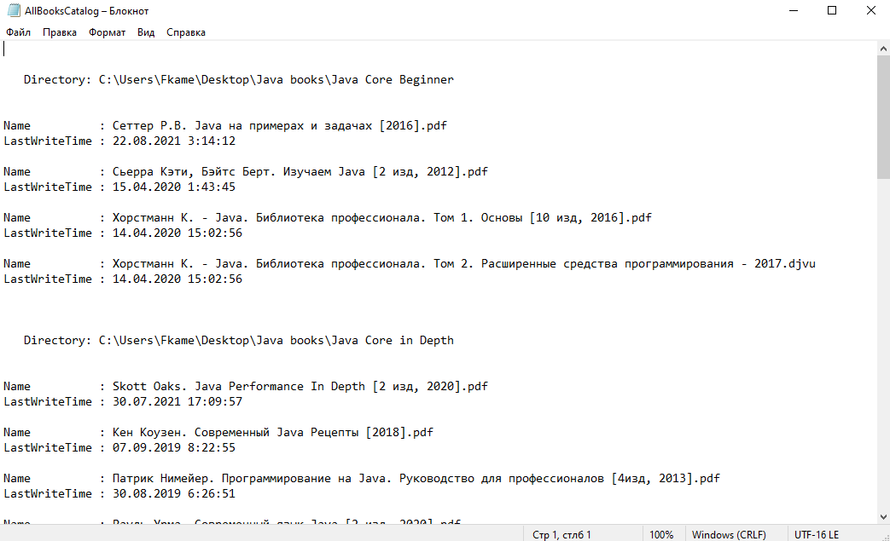

# Что это?
Это небольшой Powershell скрипт, который рекурсивно (начиная с папки запуска скрипта и дальше вниз) ищет файлы с расширением .pdf или .djvu и выводит в файл сгрупированную информацию о том, в каком каталоге какие файлы лежат.

Файл помещается в ту же папку, откуда вызван скрипт.

# Скриншот с примером

